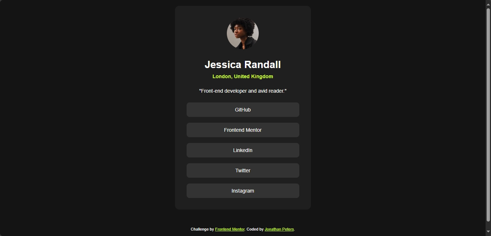
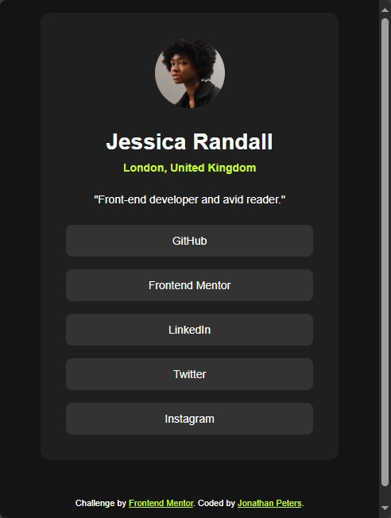

# Frontend Mentor - Social links profile solution

This is a solution to the [Social links profile challenge on Frontend Mentor](https://www.frontendmentor.io/challenges/social-links-profile-UG32l9m6dQ). Frontend Mentor challenges help you improve your coding skills by building realistic projects. 

## Overview

### The challenge

Users should be able to:

- See hover and focus states for all interactive elements on the page

### Screenshots

#### Desktop View
<a href="#">

</a>


#### Mobile View
<a href="#">

</a>


### Links

- Solution URL: [Add solution URL here](https://your-solution-url.com)
- Live Site URL: [Add live site URL here](https://your-live-site-url.com)

## My process

Here's my process for completing the Social Links Profile project:

1. Project Setup and Planning
Analyzed the design requirements from the style guide
Set up the basic project structure with HTML and CSS files
Planned the responsive breakpoints (375px mobile, 1440px desktop)
2. HTML Structure:
```
<!DOCTYPE html>
<html lang="en">
  <!-- Used semantic HTML5 elements -->
  <main class="profile-card">
    <!-- Organized content hierarchically -->
    <!-- Added proper accessibility attributes -->
  </main>
</html>
```

3. CSS Architecture:
```
:root {
  /* Implemented CSS custom properties for colors */
  --color-green: hsl(75, 94%, 57%);
  /* ...other color variables... */
}

/* Used mobile-first approach */
/* Implemented flexbox for layouts */
/* Added smooth transitions for interactions */
```

4. Key Development Steps
    1. Base Styles:
        Set up typography with Inter font
        Implemented color system
        Added reset styles
    2. Component Development:
        Built profile card container
        Styled profile image and text
        Created social links buttons
    3. Responsive Design:
        Implemented mobile layout first
        Added desktop breakpoint adjustments
        Tested various screen sizes
    4. Interactive Elements:
        Added hover states for links
        Ensured smooth transitions
        Tested focus states for accessibility


### Built with

- Semantic HTML5 markup
- CSS custom properties
- Flexbox
- CSS Grid


### What I learned

1. **CSS Custom Properties**
```css
:root {
  --color-green: hsl(75, 94%, 57%);
  --color-grey-900: hsl(0, 0%, 8%);
}
```
Using CSS variables made it easier to maintain consistent colors throughout the project and would make future theme changes simpler.

2. **Flexbox Layout**
```css
.social-links {
  display: flex;
  flex-direction: column;
  gap: 1rem;
}
```
Deepened my understanding of flexbox for creating responsive layouts, particularly using `gap` property for consistent spacing.

3. **Interactive States**
```css
.social-link:hover {
  background-color: var(--color-green);
  transition: all 0.3s ease;
}
```
Learned how to create smooth transitions for hover states and ensure good user feedback for interactive elements.

4. **Mobile-First Approach**
```css
.profile-card {
  width: 100%;
  max-width: 375px;
}

@media screen and (min-width: 1440px) {
  .profile-card {
    max-width: 384px;
  }
}
```
Practiced building responsive designs starting with mobile views and scaling up, which resulted in cleaner CSS.

5. **Semantic HTML**
Enhanced my knowledge of using semantic HTML elements for better accessibility and SEO:
```html
<main class="profile-card">
  <h1 class="profile-name">Jessica Randall</h1>
</main>
```

### Continued Development
1. Advanced CSS Layouts
    Master CSS Grid for more complex layouts
    Explore CSS Container Queries for more granular responsive design
    Practice combining Flexbox and Grid for sophisticated layouts

2. CSS Architecture
```
/* Learn BEM methodology */
.profile-card {}
.profile-card__image {}
.profile-card__link--active {}
```

3. Accessibility Enhancements
    Learn ARIA attributes
    Practice keyboard navigation
    Study color contrast requirements
    Test with screen readers

4. JavaScript Integration
```// Add interactive features like:
- Form validation
- Dynamic theme switching
- Animated transitions
- API integration for real social media links```

5. Build Tools & Optimization
    Learn Sass/SCSS for better CSS organization
    Explore CSS-in-JS solutions
    Study performance optimization techniques


### Useful Resources
1. MDN Web Docs - Comprehensive documentation for HTML, CSS, and JavaScript
2. CSS Tricks - Great for learning advanced CSS techniques and layouts
3. Frontend Mentor - More challenges to practice your skills
4. Web.dev - Google's resource for modern web development
5. Accessibility Developer Guide - Learn about web accessibility


## Author

- Website - [Add your name here](https://www.your-site.com)
- Frontend Mentor - [@yourusername](https://www.frontendmentor.io/profile/yourusername)
- Twitter - [@DJJonnas85](https://www.twitter.com/DJJonnas85)


